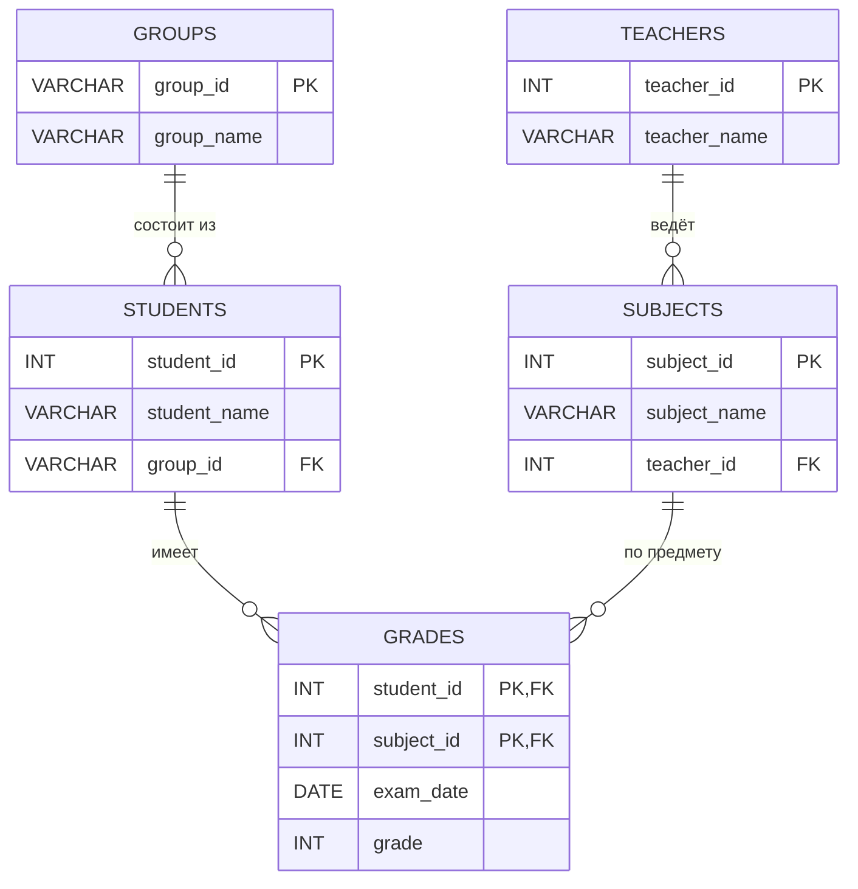

# Часть 2. Практическая нормализация (3NF)

## Итоговый список таблиц (после нормализации до 3НФ)

1. **groups** — группы студентов  
2. **students** — студенты  
3. **teachers** — преподаватели  
4. **subjects** — предметы (с привязкой к преподавателю)  
5. **grades** — результаты тестирования (оценки)

---

## ER-диаграмма (текстовая схема + Mermaid)

### Текстовая схема связей

```
groups (1) ──────< (N) students
teachers (1) ─────< (N) subjects
students (1) ─────< (N) grades
subjects (1) ─────< (N) grades
```

### Mermaid ER-диаграмма



---

## Описание таблиц и атрибутов

### 1. groups
| Колонка     | Тип          | Параметры              | Описание              |
|-------------|--------------|------------------------|-----------------------|
| group_id    | VARCHAR(10)  | PRIMARY KEY, NOT NULL  | Идентификатор группы  |
| group_name  | VARCHAR(50)  | NOT NULL               | Название группы       |

### 2. students
| Колонка       | Тип          | Параметры                        | Описание                |
|---------------|--------------|----------------------------------|-------------------------|
| student_id    | INT          | PRIMARY KEY, NOT NULL            | Идентификатор студента  |
| student_name  | VARCHAR(100) | NOT NULL                         | ФИО студента            |
| group_id      | VARCHAR(10)  | FOREIGN KEY, NOT NULL            | Ссылка на группу        |

### 3. teachers
| Колонка       | Тип          | Параметры              | Описание                   |
|---------------|--------------|------------------------|----------------------------|
| teacher_id    | INT          | PRIMARY KEY, NOT NULL  | Идентификатор преподавателя|
| teacher_name  | VARCHAR(100) | NOT NULL               | ФИО преподавателя          |

### 4. subjects
| Колонка       | Тип          | Параметры                        | Описание                |
|---------------|--------------|----------------------------------|-------------------------|
| subject_id    | INT          | PRIMARY KEY, NOT NULL            | Идентификатор предмета  |
| subject_name  | VARCHAR(100) | NOT NULL                         | Название предмета       |
| teacher_id    | INT          | FOREIGN KEY, NOT NULL            | Преподаватель предмета  |

### 5. grades
| Колонка     | Тип     | Параметры                                      | Описание                     |
|-------------|---------|------------------------------------------------|------------------------------|
| student_id  | INT     | PRIMARY KEY (часть), FOREIGN KEY, NOT NULL     | Студент                      |
| subject_id  | INT     | PRIMARY KEY (часть), FOREIGN KEY, NOT NULL     | Предмет                      |
| exam_date   | DATE    | NOT NULL                                       | Дата экзамена/теста          |
| grade       | INT     | NOT NULL                                       | Оценка (обычно 2–5)          |

> **Примечание:** составной первичный ключ `(student_id, subject_id)` гарантирует, что у студента может быть только одна оценка по каждому предмету.

---

## Почему это 3NF

- **1NF** — все атрибуты атомарны.
- **2NF** — нет частичных зависимостей от составного ключа (все неключевые атрибуты в `grades` зависят от всего ключа; остальные таблицы имеют простые ключи).
- **3NF** — нет транзитивных зависимостей:  
  - `group_name` вынесен в отдельную таблицу;  
  - `teacher_name` вынесен в отдельную таблицу;  
  - `subject_name` зависит только от `subject_id`.
